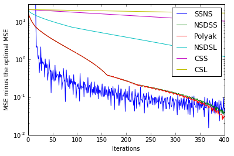
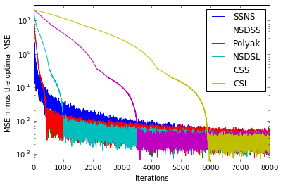
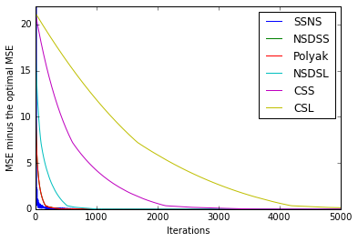
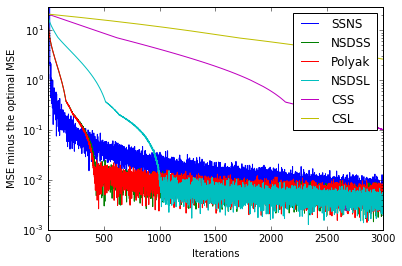
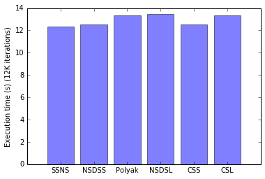
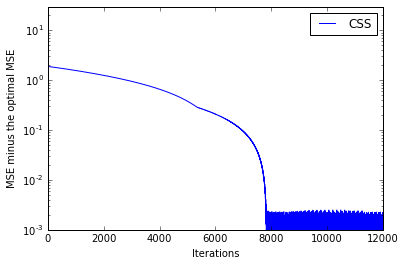
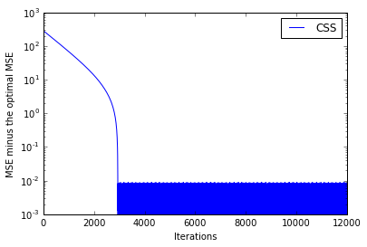

```python
import numpy as np
import math

def func_constant_step_size(sub_gradient, iteration, diff_from_best_estimate):
    return 0.0004

def func_constant_step_length(sub_gradient, iteration, diff_from_best_estimate):
    global csl_initial_norm
    N,M,_ = sub_gradient.shape
    norm = 0
    for i in range(N):
        norm += np.trace(np.matmul(sub_gradient[i], np.transpose(sub_gradient[i])))
    return 0.002 / np.sqrt(norm)
        
def func_square_summable_not_summable(sub_gradient, iteration, diff_from_best_estimate):
    return 3.0 / (iteration + 1)

def func_not_summable_diminishing_step_size(sub_gradient, iteration, diff_from_best_estimate):
    return 0.035 / np.sqrt(iteration + 1)

def func_not_summable_diminishing_step_length(sub_gradient, iteration, diff_from_best_estimate):
    global nsdsl_initial_norm
    N,M,_ = sub_gradient.shape
    norm = 0
    for i in range(N):
        norm += np.trace(np.matmul(sub_gradient[i], np.transpose(sub_gradient[i])))
    return 0.19 / np.sqrt(norm * (iteration + 1))

def func_polyak_with_estimate(sub_gradient, iteration, diff_from_best_estimate):
    global polyak_initial_norm
    N,M,_ = sub_gradient.shape
    norm = 0
    for i in range(N):
        norm += np.trace(np.matmul(sub_gradient[i], np.transpose(sub_gradient[i])))
    return (0.035 * norm / np.sqrt(iteration + 1) + diff_from_best_estimate) / norm

# Projected Subgradient Method

# Usage:
#   a_i, mse, v_opt, v_ij_opt = gdof (
#    N, M, 
#    joint_covariance, 
#    unknown_index_matrix)
#
# Inputs:
#   N - the input measurement count
#   M - the input measurement dimension
#   joint_covariance - the joint covariance matrix
#       for the all the measurements. It's a 4-d
#       tensor, with the first two dimensions
#       referring to the measurements and the last
#       two dimensions referring to the measurement
#       components. For unknown cross-correlation
#       matrices, the values are not used.
#   unknown_index_matrix - a bool numpy array.
#       the element of the matrix at
#       location (i,j) is set to be one if V_ij is unknown.
#       otherwise it is set to be zero.
#
# Outputs:
# . a_i - the matrix weights, a tensor of 3d, with the first
# .       dimension index being the measurement index
# . mse - the resulting mean square error
# . v_opt - the estimate covariance
#   v_ij_opt - the maximizing cross correlation matrix at (i,j)
def PSG(N, M, joint_covariance, unknown_index_matrix, step_func=func_constant_step_size, max_iteration=12000):
    assert (N, N, M, M) == joint_covariance.shape
    assert (N, N) == unknown_index_matrix.shape
    V = joint_covariance
    B = np.zeros((N, M, M), dtype=np.float32)
    Lambda_inv_sqrt = np.zeros((N,M), dtype=np.float32)
    U = np.zeros((N, M, M), dtype=np.float32)
    for i in range(N):
        Lambda_inv_sqrt[i], U[i] = np.linalg.eigh(joint_covariance[i, i])
        Lambda_inv_sqrt[i] = np.reciprocal(np.sqrt(Lambda_inv_sqrt[i]))
        B[i] = np.matmul(np.diag(Lambda_inv_sqrt[i]), np.transpose(U[i]))
    
    V_prime = np.zeros((N, N, M, M), dtype=np.float32)
    for i in range(N):
        for j in range(N):
            if i != j and (not unknown_index_matrix[i, j]):
                V_prime[i, j] = np.matmul(np.diag(Lambda_inv_sqrt[i]), np.transpose(U[i]))
                V_prime[i, j] = np.matmul(V_prime[i, j], V[i, j])
                V_prime[i, j] = np.matmul(V_prime[i, j], U[j])
                V_prime[i, j] = np.matmul(V_prime[i, j], np.diag(Lambda_inv_sqrt[j]))
    
    Sigma = np.zeros((M, M), dtype=np.float32)
    for i in range(N):
        Sigma = Sigma + np.linalg.inv(V[i, i])
    Sigma_inv = np.linalg.inv(Sigma)

    # initial A_prime values
    A_prime = np.zeros((N, M, M), dtype=np.float32)
    for i in range(N):
        A_prime[i] = np.matmul(U[i], np.diag(np.reciprocal(Lambda_inv_sqrt[i]))) / N

    epislon = 1.0e-12
    mse = np.finfo(np.float32).max
    mse_iteration = []
    mse_best = np.finfo(np.float32).max
    last_mse_diff = 0
    A_prime_best = np.zeros((N, M, M), dtype=np.float32)
    for iteration in range(max_iteration):

        # Get SVD of A[j]^T A[i]
        C = np.zeros((N, N, M, M), dtype=np.float32)
        D = np.zeros((N, N, M, M), dtype=np.float32)
        Lambda_ij = np.zeros((N, N, M), dtype=np.float32)
        for i in range(N):
            for j in range(N):
                if i != j and unknown_index_matrix[i, j]:
                    C[i, j], Lambda_ij[i, j], D[i, j] = np.linalg.svd(np.matmul(np.transpose(A_prime[j]), A_prime[i]))
                    D[i, j] = np.transpose(D[i, j]) # convention of python linalg library
                    
        # compute subgradients
        dA_prime = np.zeros((N, M, M), np.float32)
        for i in range(N):
            dA_prime[i] = A_prime[i]
            for j in range(N):
                if j != i:
                    if unknown_index_matrix[i, j]:
                        dA_prime[i] = dA_prime[i] + np.matmul(np.matmul(A_prime[j], C[i, j]), np.transpose(D[i, j]))
                    else:
                        dA_prime[i] = dA_prime[i] + np.matmul(A_prime[j], np.transpose(V_prime[i, j]))
            dA_prime[i] = dA_prime[i] * 2.0

        # apply step size & subgradient
        step = step_func(dA_prime, iteration, last_mse_diff)
        for i in range(N):
            A_prime[i] = A_prime[i] - dA_prime[i] * step
            
        # project onto the constraint hyperplanes
        A_prime_dot_B = np.zeros((M, M), np.float32)
        for i in range(N):
            A_prime_dot_B = A_prime_dot_B + np.matmul(A_prime[i], B[i])
        A_prime_dot_B_Sigma_inv = np.matmul(np.eye(M, dtype=np.float32) - A_prime_dot_B, Sigma_inv)
        for i in range(N):
            A_prime[i] = A_prime[i] + np.matmul(A_prime_dot_B_Sigma_inv, np.transpose(B[i]))

        # compute mse
        mse_prime = 0.0
        for i in range(N):
            mse_prime = mse_prime + np.trace(np.matmul(np.transpose(A_prime[i]), A_prime[i]))
        for i in range(N):
            for j in range(N):
                if i != j:
                    if unknown_index_matrix[i, j]:
                        _, sigmas, _ = np.linalg.svd(np.matmul(np.transpose(A_prime[j]), A_prime[i]))
                        mse_prime = mse_prime + np.sum(sigmas)
                    else:
                        mse_prime = mse_prime + np.trace(np.matmul(np.matmul(A_prime[i], V_prime[i, j]), np.transpose(A_prime[j])))
        
        mse_iteration.append(mse_prime)
        #print('mse: ', mse_prime, mse_best, sigmas, A_prime)
        if mse_prime < mse_best:
            mse_best = mse_prime
            A_prime_best = A_prime
            last_mse_diff = 0
        last_mse_diff = mse_prime - mse_best
    
    A = np.zeros((N, M, M), dtype=np.float32)
    for i in range(N):
        A[i] = np.matmul(np.matmul(A_prime_best[i], np.diag(Lambda_inv_sqrt[i])), np.transpose(U[i]))
    V_ij_opt = np.zeros((N, N, M, M), dtype=np.float32)
    for i in range(N):
        for j in range(N):
            if i != j and unknown_index_matrix[i, j]:
                C_ij, Lambda_ij, D_ij = np.linalg.svd(np.matmul(np.transpose(A_prime_best[j]), A_prime_best[i]))
                part_left = np.matmul(U[i], np.diag(np.reciprocal(Lambda_inv_sqrt[i])))
                part_middle = np.matmul(np.transpose(D_ij), np.transpose(C_ij))
                part_right = np.matmul(np.diag(np.reciprocal(Lambda_inv_sqrt[j])), np.transpose(U[j]))
                V_ij_opt[i, j] = np.matmul(np.matmul(part_left, part_middle), part_right)
    V_opt = np.zeros((M, M), dtype=np.float32)
    for i in range(N):
        for j in range(N):
            if i != j and unknown_index_matrix[i, j]:
                V_opt = V_opt + np.matmul(np.matmul(A[i], V_ij_opt[i, j]), np.transpose(A[j]))
            else:
                V_opt = V_opt + np.matmul(np.matmul(A[i], V[i, j]), np.transpose(A[j]))
    
    return A, mse_best, V_opt, V_ij_opt, mse_iteration
```


```python
# Test case 1 from Spyridon Leonardos and Kostas Daniilidis
import time

x1 = np.array([0.0, 0.0], np.float32)
V11 = np.array([[5.0, 0], [0, 1.0]], np.float32)

x2 = np.array([0.0, 0.0], np.float32)
V22 = np.array([[2.0, 0], [0, 7.0]], np.float32)

x3 = np.array([0.0, 0.0], np.float32)
V33 = np.array([[4.0, 0], [0, 100.0]], np.float32)

joint_covariance = np.array([[V11, V11, V11],[V22, V22, V22], [V33, V33, V33]], np.float32)
unknown_index_matrix = np.array([[False, True, True], [True, False, True], [True, True, False]], dtype=bool)
N = 3
M = 2

start_time = time.time()
a_i, mse, v_opt, v_ij_opt, mse_css_iteration = PSG(N, M, joint_covariance, unknown_index_matrix)
css_elapsed_time = time.time() - start_time
print('CSS - Elapsed time: ', css_elapsed_time)
print('CSS - A_i: ', a_i)
print('CSS - MSE: ', mse)
print('CSS - Covariance: ', v_opt)
#print('CSS - Missing covariance matrics: ', v_ij_opt)

start_time = time.time()
a_i, mse, v_opt, v_ij_opt, mse_csl_iteration = PSG(N, M, joint_covariance, unknown_index_matrix, step_func=func_constant_step_length)
csl_elapsed_time = time.time() - start_time
print('CSL - Elapsed time: ', csl_elapsed_time)
print('CSL - A_i: ', a_i)
print('CSL - MSE: ', mse)
print('CSL - Covariance: ', v_opt)
#print('CSL - Missing covariance matrics: ', v_ij_opt)

start_time = time.time()
a_i, mse, v_opt, v_ij_opt, mse_ssns_iteration = PSG(N, M, joint_covariance, unknown_index_matrix, step_func=func_square_summable_not_summable)
ssns_elapsed_time = time.time() - start_time
print('SSNS - Elapsed time: ', ssns_elapsed_time)
print('SSNS - A_i: ', a_i)
print('SSNS - MSE: ', mse)
print('SSNS - Covariance: ', v_opt)
#print('SSNS - Missing covariance matrics: ', v_ij_opt)

start_time = time.time()
a_i, mse, v_opt, v_ij_opt, mse_nsdss_iteration = PSG(N, M, joint_covariance, unknown_index_matrix, step_func=func_not_summable_diminishing_step_size)
nsdss_elapsed_time = time.time() - start_time
print('NSDSS - Elapsed time: ', nsdss_elapsed_time)
print('NSDSS - A_i: ', a_i)
print('NSDSS - MSE: ', mse)
print('NSDSS - Covariance: ', v_opt)
#print('NSDSS - Missing covariance matrics: ', v_ij_opt)

start_time = time.time()
a_i, mse, v_opt, v_ij_opt, mse_nsdsl_iteration = PSG(N, M, joint_covariance, unknown_index_matrix, step_func=func_not_summable_diminishing_step_length)
nsdsl_elapsed_time = time.time() - start_time
print('NSDSL - Elapsed time: ', nsdsl_elapsed_time)
print('NSDSL - A_i: ', a_i)
print('NSDSL - MSE: ', mse)
print('NSDSL - Covariance: ', v_opt)
#print('NSDSL - Missing covariance matrics: ', v_ij_opt)

start_time = time.time()
a_i, mse, v_opt, v_ij_opt, mse_polyak_iteration = PSG(N, M, joint_covariance, unknown_index_matrix, step_func=func_polyak_with_estimate)
polyak_elapsed_time = time.time() - start_time
print('Polyak - Elapsed time: ', polyak_elapsed_time)
print('Polyak - A_i: ', a_i)
print('Polyak - MSE: ', mse)
print('Polyak - Covariance: ', v_opt)
#print('Polyak - Missing covariance matrics: ', v_ij_opt)
```

    CSS - Elapsed time:  12.525400400161743
    CSS - A_i:  [[[  5.84949332e-04  -5.69667100e-06]
      [  1.05750678e-05   9.99837339e-01]]
    
     [[  9.99403179e-01   6.91898595e-06]
      [ -1.61105481e-06   1.76687012e-04]]
    
     [[  1.17902819e-05  -1.22231438e-06]
      [ -8.96401252e-06  -1.40543680e-05]]]
    CSS - MSE:  3.00069713954
    CSS - Covariance:  [[ 2.00138736 -0.00620303]
     [-0.00620303  1.00089324]]
    CSL - Elapsed time:  13.378360986709595
    CSL - A_i:  [[[  4.82194038e-04   3.36865924e-06]
      [ -3.97587598e-07   1.00003660e+00]]
    
     [[  9.99420941e-01  -3.66680638e-06]
      [  1.36685721e-05   1.06899752e-05]]
    
     [[  9.68631211e-05   2.98146659e-07]
      [ -1.32709838e-05  -4.72607499e-05]]]
    CSL - MSE:  3.00046790961
    CSL - Covariance:  [[ 2.00128174  0.02190318]
     [ 0.02190318  1.00107741]]
    SSNS - Elapsed time:  12.340394973754883
    SSNS - A_i:  [[[  3.31976917e-04   4.02813157e-07]
      [  7.65390359e-06   9.99993682e-01]]
    
     [[  9.99514103e-01   1.62012753e-07]
      [  1.91603758e-05   4.41279990e-05]]
    
     [[  1.53942470e-04  -5.64825825e-07]
      [ -2.68142794e-05  -3.78400982e-05]]]
    SSNS - MSE:  3.00049569569
    SSNS - Covariance:  [[ 2.00102663  0.03348528]
     [ 0.03348528  1.00098646]]
    NSDSS - Elapsed time:  12.558707475662231
    NSDSS - A_i:  [[[  1.25427192e-04  -2.58941509e-06]
      [ -2.23962470e-05   9.99765396e-01]]
    
     [[  9.99603450e-01   9.12019573e-07]
      [ -6.14762685e-05   1.86566016e-04]]
    
     [[  2.71073746e-04   1.67739495e-06]
      [  8.38725173e-05   4.80080780e-05]]]
    NSDSS - MSE:  3.00061170602
    NSDSS - Covariance:  [[ 2.00073791 -0.1428106 ]
     [-0.14281058  1.00154817]]
    NSDSL - Elapsed time:  13.492170095443726
    NSDSL - A_i:  [[[  2.78785476e-04   4.87517173e-05]
      [  2.64479040e-05   1.00010109e+00]]
    
     [[  9.99380350e-01   2.35342141e-05]
      [  8.42529971e-06  -7.99145128e-05]]
    
     [[  3.40912491e-04  -7.22859331e-05]
      [ -3.48732065e-05  -2.11670904e-05]]]
    NSDSL - MSE:  3.00047383902
    NSDSL - Covariance:  [[ 2.00210094  0.1050216 ]
     [ 0.10502159  1.00107145]]
    Polyak - Elapsed time:  13.369536638259888
    Polyak - A_i:  [[[  3.26695212e-04   7.78456306e-05]
      [ -1.74166216e-05   1.00000131e+00]]
    
     [[  9.99579251e-01  -2.06142863e-06]
      [  9.24530104e-06  -4.49004574e-06]]
    
     [[  9.40257160e-05  -7.57841990e-05]
      [  8.17132150e-06   3.20992558e-06]]]
    Polyak - MSE:  3.00069604128
    Polyak - Covariance:  [[ 2.00260377  0.16489613]
     [ 0.16489612  1.00010133]]


```python
import matplotlib
import numpy as np
import matplotlib.pyplot as plt
%matplotlib inline  
plt.ylim((1.0e-2, 30.0))
plt.xlim((0.0, 400.0))
plt.yscale('log')
plt.plot(np.array(mse_ssns_iteration, dtype=np.float32) - 3.0, label="SSNS")
plt.plot(np.array(mse_nsdss_iteration, dtype=np.float32) - 3.0, label="NSDSS")
plt.plot(np.array(mse_polyak_iteration, dtype=np.float32) - 3.0, label="Polyak")
plt.plot(np.array(mse_nsdsl_iteration, dtype=np.float32) - 3.0, label="NSDSL")
plt.plot(np.array(mse_css_iteration, dtype=np.float32) - 3.0, label="CSS")
plt.plot(np.array(mse_csl_iteration, dtype=np.float32) - 3.0, label="CSL")
plt.ylabel('MSE minus the optimal MSE')
plt.xlabel('Iterations')
plt.legend()

plt.figure()
plt.ylim((6.0e-4, 30.0))
plt.xlim((0.0, 8000.0))
plt.yscale('log')
plt.plot(np.array(mse_ssns_iteration, dtype=np.float32) - 3.0, label="SSNS")
plt.plot(np.array(mse_nsdss_iteration, dtype=np.float32) - 3.0, label="NSDSS")
plt.plot(np.array(mse_polyak_iteration, dtype=np.float32) - 3.0, label="Polyak")
plt.plot(np.array(mse_nsdsl_iteration, dtype=np.float32) - 3.0, label="NSDSL")
plt.plot(np.array(mse_css_iteration, dtype=np.float32) - 3.0, label="CSS")
plt.plot(np.array(mse_csl_iteration, dtype=np.float32) - 3.0, label="CSL")
plt.ylabel('MSE minus the optimal MSE')
plt.xlabel('Iterations')
plt.legend()

plt.figure()
plt.ylim((1.0e-4, 22.0))
plt.xlim((0.0, 5000.0))
plt.plot(np.array(mse_ssns_iteration, dtype=np.float32) - 3.0, label="SSNS")
plt.plot(np.array(mse_nsdss_iteration, dtype=np.float32) - 3.0, label="NSDSS")
plt.plot(np.array(mse_polyak_iteration, dtype=np.float32) - 3.0, label="Polyak")
plt.plot(np.array(mse_nsdsl_iteration, dtype=np.float32) - 3.0, label="NSDSL")
plt.plot(np.array(mse_css_iteration, dtype=np.float32) - 3.0, label="CSS")
plt.plot(np.array(mse_csl_iteration, dtype=np.float32) - 3.0, label="CSL")
plt.ylabel('MSE minus the optimal MSE')
plt.xlabel('Iterations')
plt.legend()

plt.figure()
plt.ylim((1.0e-3, 30.0))
plt.xlim((0.0, 3000.0))
plt.yscale('log')
plt.plot(np.array(mse_ssns_iteration, dtype=np.float32) - 3.0, label="SSNS")
plt.plot(np.array(mse_nsdss_iteration, dtype=np.float32) - 3.0, label="NSDSS")
plt.plot(np.array(mse_polyak_iteration, dtype=np.float32) - 3.0, label="Polyak")
plt.plot(np.array(mse_nsdsl_iteration, dtype=np.float32) - 3.0, label="NSDSL")
plt.plot(np.array(mse_css_iteration, dtype=np.float32) - 3.0, label="CSS")
plt.plot(np.array(mse_csl_iteration, dtype=np.float32) - 3.0, label="CSL")
plt.ylabel('MSE minus the optimal MSE')
plt.xlabel('Iterations')
plt.legend()

plt.figure()
objects = ('SSNS', 'NSDSS', 'Polyak', 'NSDSL', 'CSS', 'CSL')
y_pos = np.arange(len(objects))
performance = [ssns_elapsed_time, nsdss_elapsed_time,polyak_elapsed_time,nsdsl_elapsed_time,css_elapsed_time,csl_elapsed_time]
plt.bar(y_pos, performance, align='center', alpha=0.5)
plt.xticks(y_pos, objects)
plt.ylabel('Execution time (s) (12K iterations)')

```


    <matplotlib.text.Text at 0x7f35b7f43860>

















```python
# Test case 1 from Spyridon Leonardos and Kostas Daniilidis
import time

x1 = np.array([0.0, 0.0], np.float32)
V11 = np.array([[5.0, 0], [0, 5.0]], np.float32)

x2 = np.array([0.0, 0.0], np.float32)
V22 = np.array([[3.0, 0], [0, 7.0]], np.float32)

joint_covariance = np.array([[V11, V11],[V22, V22]], np.float32)
unknown_index_matrix = np.array([[False, True], [True, False]], dtype=bool)
N = 2
M = 2
start_time = time.time()
a_i, mse, v_opt, v_ij_opt, mse_iteration = PSG(N, M, joint_covariance, unknown_index_matrix)
elapsed_time = time.time() - start_time
print('Elapsed time: ', elapsed_time)
print('A_i: ', a_i)
print('MSE: ', mse)
print('Covariance: ', v_opt)
print('Missing covariance matrics: ', v_ij_opt)
plt.figure()
plt.ylim((1.0e-3, 30.0))
plt.xlim((0.0, 12000.0))
plt.yscale('log')
plt.plot(np.array(mse_iteration, dtype=np.float32) - 8.0, label="CSS")
plt.ylabel('MSE minus the optimal MSE')
plt.xlabel('Iterations')
plt.legend()

```

    Elapsed time:  5.101805686950684
    A_i:  [[[  1.98399313e-04   0.00000000e+00]
      [  0.00000000e+00   9.99693990e-01]]
    
     [[  9.99801517e-01   0.00000000e+00]
      [  0.00000000e+00   3.06091213e-04]]]
    MSE:  8.00001478841
    Covariance:  [[ 3.00034571  0.        ]
     [ 0.          5.00056076]]
    Missing covariance matrics:  [[[[ 0.          0.        ]
       [ 0.          0.        ]]
    
      [[ 3.87298369  0.        ]
       [ 0.          5.91607952]]]
    
    
     [[[ 3.87298369  0.        ]
       [ 0.          5.91607952]]
    
      [[ 0.          0.        ]
       [ 0.          0.        ]]]]


    <matplotlib.legend.Legend at 0x7f35b7d8e1d0>





```python
# Test case 2 from Spyridon Leonardos and Kostas Daniilidis
import time

x1 = np.array([0.0, 0.0], np.float32)
V11 = np.array([[5.0, 0], [0, 5.0]], np.float32)

x2 = np.array([0.0, 0.0], np.float32)
V22 = np.array([[1.0, 0], [0, 1000.0]], np.float32)

joint_covariance = np.array([[V11, V11],[V22, V22]], np.float32)
unknown_index_matrix = np.array([[False, True], [True, False]], dtype=bool)
N = 2
M = 2
start_time = time.time()
a_i, mse, v_opt, v_ij_opt, mse_iteration = PSG(N, M, joint_covariance, unknown_index_matrix)
elapsed_time = time.time() - start_time
print('Elapsed time: ', elapsed_time)
print('A_i: ', a_i)
print('MSE: ', mse)
print('Covariance: ', v_opt)
print('Missing covariance matrics: ', v_ij_opt)
plt.figure()
plt.ylim((1.0e-3, 1000.0))
plt.xlim((0.0, 12000.0))
plt.yscale('log')
plt.plot(np.array(mse_iteration, dtype=np.float32) - 6.0, label="CSS")
plt.ylabel('MSE minus the optimal MSE')
plt.xlabel('Iterations')
plt.legend()

```

    Elapsed time:  5.154732942581177
    A_i:  [[[  6.11606883e-05   0.00000000e+00]
      [  0.00000000e+00   9.99992430e-01]]
    
     [[  9.99938846e-01   0.00000000e+00]
      [  0.00000000e+00   7.62816626e-06]]]
    MSE:  6.00004890571
    Covariance:  [[ 1.00015116  0.        ]
     [ 0.          5.00100327]]
    Missing covariance matrics:  [[[[  0.           0.        ]
       [  0.           0.        ]]
    
      [[  2.23606801   0.        ]
       [  0.          70.71067047]]]
    
    
     [[[  2.23606801   0.        ]
       [  0.          70.71067047]]
    
      [[  0.           0.        ]
       [  0.           0.        ]]]]


    <matplotlib.legend.Legend at 0x7f35b789d898>




